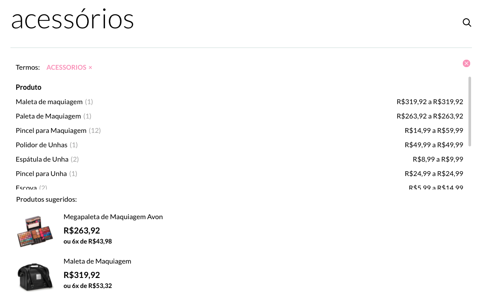
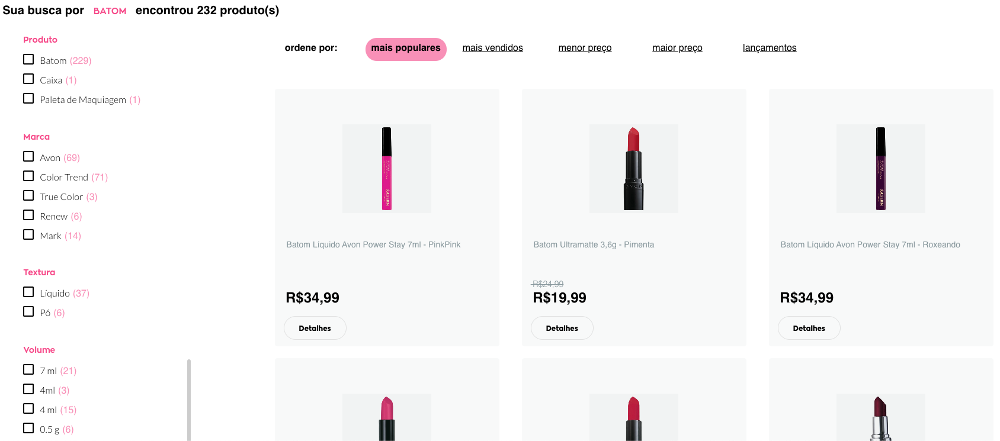

# Vtex IO Search App

Além do acesso via API, também disponibilizamos um app nativo VTEX IO para os clientes que utilizam esta plataforma.

Ao instalar nosso app você poderá utilizar nossos componentes prontos para:

- Autocomplete na barra de busca
- Página de resultados de busca
- Páginas de Departamento/Categorias
- Criação de Landing Pages

# Instalação

Primeiramente será necessário a criação de um usuário para a Omnilogic com permissão de acesso ao CMS e ao módulo do VTEX IO. De posse deste acesso iremos instalar a nossa aplicação em sua conta da vtex. 
Feito isso basta você adicionar a seguinte tag HTML ao template de header da sua loja, para incluir o autocomplete:

```html
<vtex:renderPlaceHolder id="omnilogic-input" myVtexPath="/legacy-extensions/omnilogic/search" extensionPoint="omnilogic-search/input"/>
```

e inserir a seguinte tag no template de busca, para obter os resultados da API da Omnilogic:

```html
<vtex:renderPlaceHolder id="omnilogic-products" myVtexPath="/legacy-extensions/omnilogic/search" extensionPoint="omnilogic-search/products"/>
```

Caso você queira configurar as páginas de departamento e categoria, basta repetir o mesmo processo para estes templates.

## Autocomplete



O componente de autocomplete possui as seguintes funcionalidades:

- Correção de termos
- Sugestão de produtos
- Filtros por atributos

## Resultados de busca



Ao realizar uma busca o usuário será redirecionado para a página de resultados que apresenta:

- Lista paginada de ofertas
- Controlador de ordenação
- Facets para filtrar os resultados

