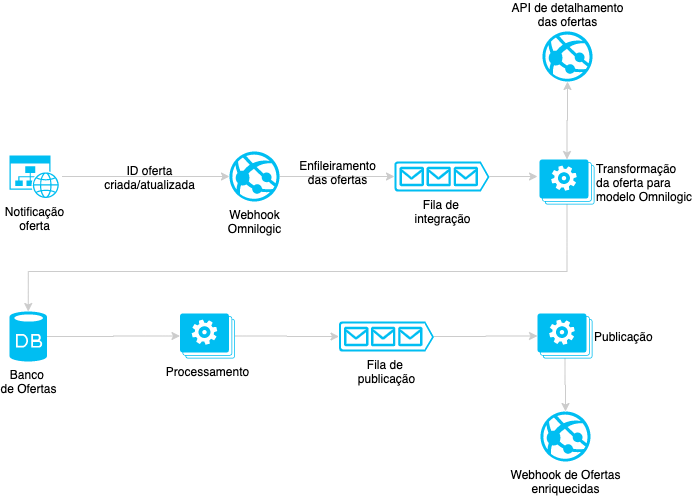

# Webhook

A integração via Webhooks é a mais indicada, por ser a mais confiável com relação ao sincronismos em "tempo real" entre os produtos da loja com a Omnilogic. Ela basicamente consiste em três componentes

- Webhook Omnilogic: para receber notificações de criação/atualização de ofertas;
- API de detalhamento do produto/sku: para pesquisar todos os dados da oferta previamente notificado;
- Webhook de retorno: para o recebimento das ofertas enriquecidas pelo Product Cloud\*.

\*Este ultimo componente só é necessário para os clientes que contrataram os serviços do Product Cloud.

O seguinte diagrama resume os sistemas envolvidos nesta integração:



Um detalhe importante é que o Webhook da Omnilogic, preferencialmente, recebe apenas o ID do oferta que sofreu alguma modificação, para logo após buscar as suas informações em uma API da loja. Esse fluxo foi arquitetado recebendo um ID e não os dados inteiros para possibilitar possíveis ressincronizações sem a necessidade de solicitar um reenvio por conta do cliente.

Entretanto, mudanças nessa estrutura **são possíveis**, caso essa arquitetura não atenda ao caso de uso da loja.

## Payload de Notificação

O cliente deverá notificar a Omnilogic sobre qualquer tipo de criação/atualização de ofertas, de modo a garantir o sincronismo das bases de dados.

Para isso será necessário realizar uma requisição do tipo POST para a seguinte URL:

https://catalog-integration.omnilogic.com.br/{{STORE}}/offer?key={{KEY}}

Contendo no body um JSON com as seguintes propriedades:

| Propriedade | Tipo   | Descrição    |
| ----------- | ------ | ------------ |
| store       | string | Nome da loja |
| id          | string | ID da oferta |

\*A chave de acesso deve ser solicitada

### Exemplo de payload

```json
{
  "store": "{{STORE}}",
  "id": "{{ID}}"
}
```

## API de detalhamento

Possuindo o ID, a Omnilogic utilizará uma API pública do cliente para obter todas as informações da oferta. Alguns dados que são esperados/desejados dessa API:

| Propriedade        | Tipo     | Descrição                               |
| ------------------ | -------- | --------------------------------------- |
| product            | string   | ID do Produto                           |
| sku                | string   | ID do SKU                               |
| seller_id\*        | string   | ID do seller                            |
| seller_offer_id\*  | string   | ID da oferta no seller                  |
| sku_title          | string   | nome do SKU                             |
| product_title      | string   | nome do Produto                         |
| description        | string   | descrição da oferta                     |
| url                | string   | url da oferta                           |
| images             | string[] | lista de imagens da oferta              |
| price              | float    | preço da oferta                         |
| list_price         | float    | preço, sem desconto, da oferta          |
| sku_attributes     | any      | atributos informados do Produto         |
| product_attributes | any      | atributos informados do SKU             |
| ean                | string   | código de barras                        |
| active             | boolean  | indicador se a oferta está ativa ou não |

## Payload de Retorno

No caso do Product Cloud, existe uma integração inversa, onde o Omnilogic retornar para o cliente um sku/produto enriquecido. Para isso, será utilizado um Webhook do cliente para o envio das seguintes informações, _podendo sofrer alterações de acordo com a necessidade do cliente_:

| Propriedade               | Tipo     | Descrição                                                       |
| ------------------------- | -------- | --------------------------------------------------------------- |
| store                     | string   |                                                                 |
| sku                       | string   | ID do SKU                                                       |
| seller_id                 | string   | ID do seller                                                    |
| seller_offer_id           | string   | ID da oferta no seller                                          |
| entity                    | string   | tipo do produto                                                 |
| metadata                  | string   | atributos extraídos                                             |
| category_id               | string   | categoria pai                                                   |
| subcategory_ids           | string[] | sub-categorias                                                  |
| product_hash              | string   | hash agrupador de produtos                                      |
| product_name              | string   | nome do produto                                                 |
| sku_hash                  | string   | hash agrupador de sku                                           |
| sku_name                  | string   | nome do sku                                                     |
| product_matching_metadata | string[] | atributos que são utilizados para o matching de produto         |
| product_name_metadata     | string[] | atributos que são utilizados para a formação do nome do produto |
| sku_metadata              | string[] | atributos que são utilizados para o matching de sku             |
| sku_name_metadata         | string[] | atributos que são utilizados para a formação do nome do sku     |
| filters_metadata          | string[] | atributos que estão configurados como filtros                   |
| offer_status              | integer  | status da oferta                   |
| status_description        | string   | descrição do status da oferta                   |
| blocked_description       | string   | descrição caso a oferta for bloqueada                   |

### Exemplo de payload

**Lembrando que o payload de retorno pode ser adaptado de acordo com as necessidades do cliente**

```json
{
  "store": "{{STORE}}",
  "sku": "{{SKU_ID}}",
  "seller_id": "{{SELLER}}",
  "seller_offer_id": "{{SELLER_OFFER_ID}}",
  "entity": "Microondas",
  "metadata": {
    "Modelo": "MEF41",
    "Marca": "Electrolux",
    "Cor": "Branco",
    "Voltagem": "220V",
    "Capacidade": "31 L"
  },
  "category_id": "{{CATEGORY}}",
  "subcategory_ids": ["{{SUB_CATEGORY}}", "{{SUB_CATEGORY}}"],
  "product_hash": "c7000c500becee4940ae3e225ff2ac67",
  "product_name": "Micro-ondas Electrolux 31L MEF41 Branco",
  "product_matching_metadata": ["Capacidade", "Marca", "Modelo", "Cor"],
  "product_name_metadata": [
    "Material",
    "Capacidade",
    "Tipo",
    "Marca",
    "Características",
    "Linha",
    "Modelo Nominal",
    "Modelo",
    "Cor"
  ],
  "sku_metadata": ["Voltagem"],
  "filters_metadata": [
    "Material",
    "Capacidade",
    "Tipo",
    "Marca",
    "Características",
    "Linha",
    "Modelo Nominal",
    "Modelo",
    "Cor",
    "Voltagem",
    "Acabamento"
  ],
  "offer_status": 44,
  "status_description": "A oferta foi publicada com sucesso!",
  "blocked_description": null
}
```
